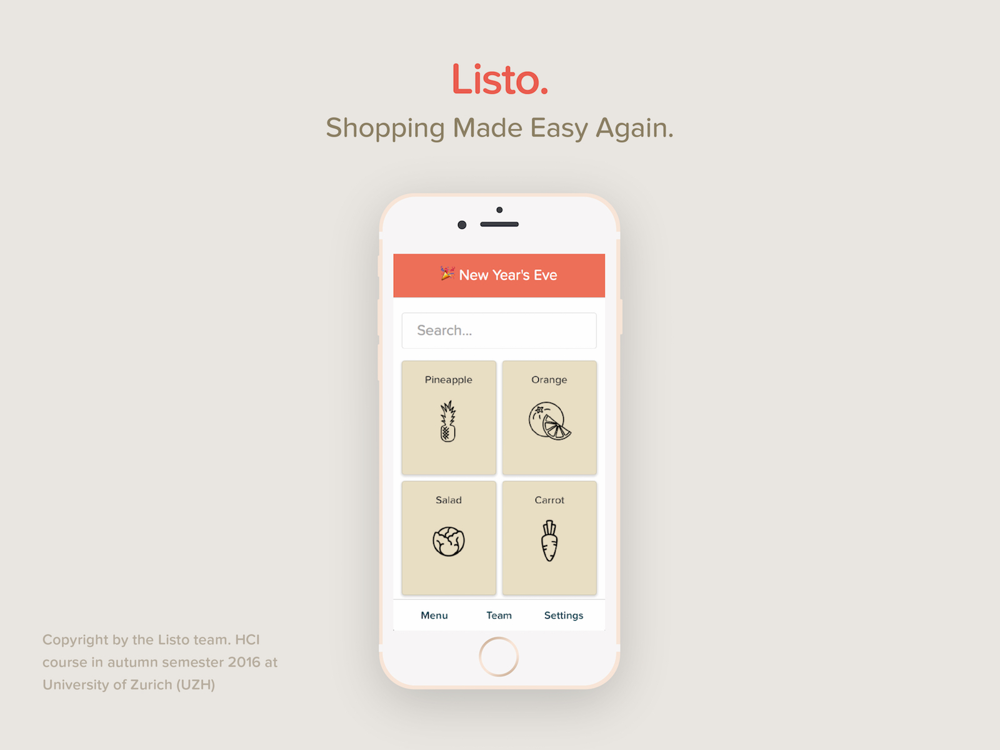

# Listo
Project for the Human-Computer Interaction (HCI) lecture during Fall Semester 2016 @ University of Zurich (UZH)

## Frameworks

This project is built with Facebook's React to render the View and with Google's Firebase as a Database. The Webapp is therefore written in Javascript with JSX and ES2015.

## How to use this project

1. Clone Repo
2. ```cd``` to folder
3. run ```npm install``` in folder
4. run ```npm run dev``` for development mode or ```npm run build``` to compile a compressed file

A working example can be found [here](http://listo.lanaya.io)

## Final Project


